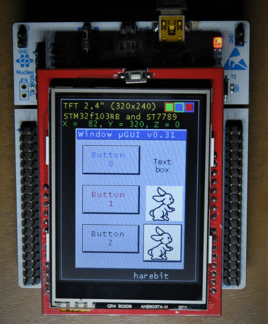

# STM32CubeMX and µGUI with TouchScreen

STM32CubeMX and µgui for all display.  
In this example I used a ST7789 driver with TFT display with a resolution of 320x240
and a nucleo board 64 with a STM32F103RBT6.
The interface is 8-bit parallel.
In this repository I used the graphic library with a touch screen

[The origin software is here](http://embeddedlightning.com/ugui/)

The screen looks like this picture

harebit
